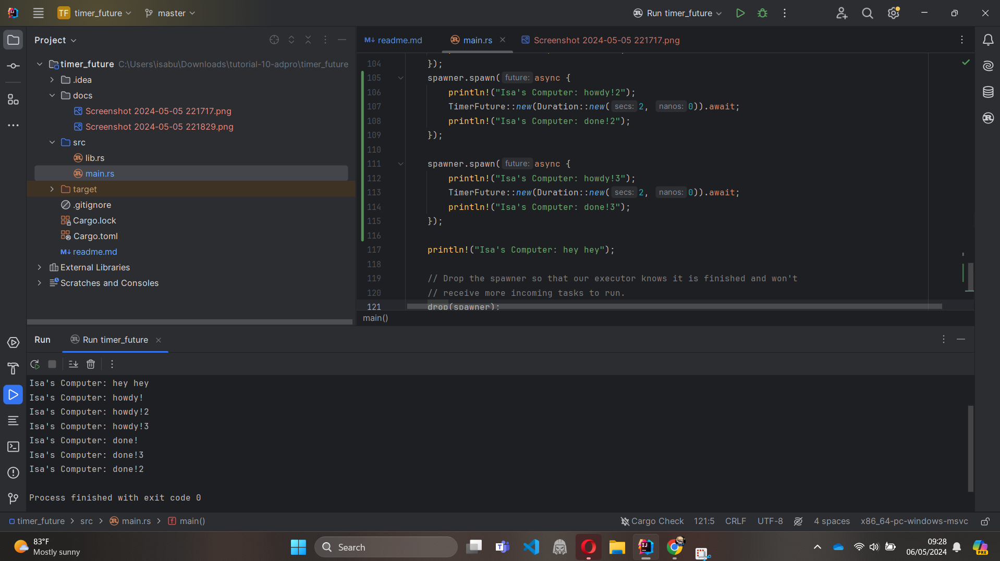
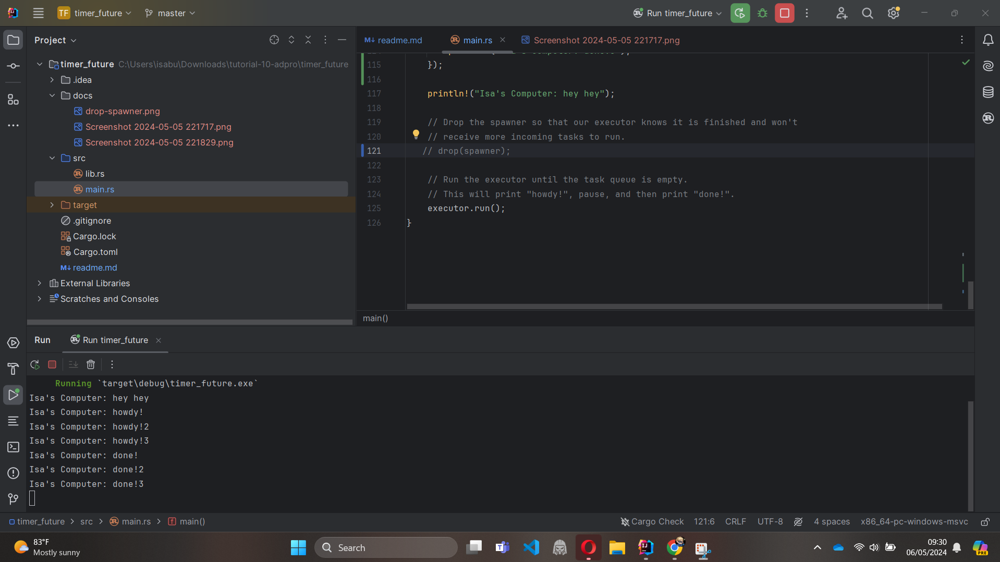

1.2 Perilaku dimana "Isa's Computer: hey hey" tercetak
lebih dahulu atau tidak menentu dibandingkan dengan 
`println` yang berada di dalam callback `spawner.spawn` terjadi
karena kita menerapkan asynchronous pada callback tersebut.
Karena sifat asynchronous, task yang dibuat 
oleh `spawner.spawn` akan dijadwalkan untuk dieksekusi, 
tetapi tidak menjamin bahwa eksekusi akan selesai 
sebelum kode selanjutnya dijalankan. Sehingga, "hey hey" 
bisa saja tercetak sebelum atau setelah task selesai, 
tergantung pada bagaimana executor menjadwalkan eksekusi 
task tersebut.

1.3  

Ketika spawner di-spawn berulang kali, maka yang terjadi adalah operasi 
yang dilakukan antar spawn dilakukan secara asynchronous sehingga urutan spawn 
yang selesai lebih dahulu tidak dijamin urutannya.

Dalam hal ini, apabila spawner di drop diakhir statement maka tidak ada 
task lagi yang dapat di-assign ke Eksekutor melalui spawner sehingga program selesai.

Namun, apabila spawner tidak di-drop maka Eksekutor akan tetap menunggu untuk tugas-tugas baru yang 
akan ditambahkan ke dalamnya melalui spawner. Program tidak akan keluar sampai spawner dibuang.

